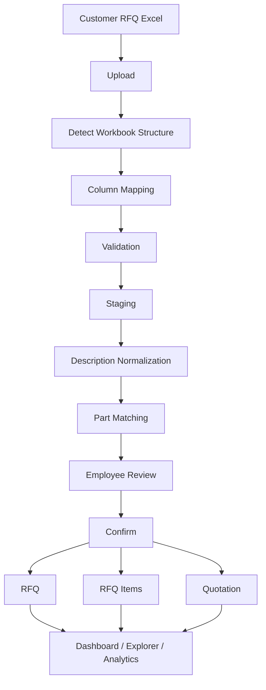

# Fluid Controls RFQ Management & Quotation Automation

# Most improtant note: Enjoy the code. Write joke etc. Just have fun.

## 1. Project Purpose

This repository contains the RFQ (Request for Quotation) module being developed for Fluid Controls.

The purpose of the system is to replace and improve the current Excel-heavy RFQ workflow by providing a structured application for:

- RFQ tracking
- Customer RFQ Excel import
- Fluid Controls Part Master Excel import
- Historical RFQ tracker import
- FCL part-code matching
- Price lookup
- Human review of suggested matches
- Quotation preparation
- RFQ status tracking
- SLA monitoring
- Historical RFQ search
- Knowledge reuse
- Dashboard and analytics
- Future integration with the main Fluid Controls application and POT module

This repository contains ONLY the RFQ module.

---

## 2. Out of Scope

The RFQ team does NOT implement:

- Login/authentication
- User account management
- RBAC administration
- Customer master management
- Purchase Order Tracking (POT)
- Main application shell
- Company-wide administration

These functions will eventually be provided by the parent Fluid Controls application.

During standalone development, mock/reference users and customers may be used.

---

## 3. Team

| Developer | Primary Ownership |
|---|---|
| Aneesh | Data Ingestion, Excel Imports, Staging, Part Matching |
| Gungun | RFQ Core, RFQ Items, Workflow, Quotations |
| Advait | RFQ Explorer, Search, History, Export, Integration |
| Aryan | Dashboard, Analytics APIs, Charts |

Everyone owns both frontend and backend work required for their functional area.

Ownership defines responsibility, not exclusive permission to edit a file.

Shared contracts must be coordinated before modification.

---

## 4. Technology Stack

### Frontend
- Next.js
- TypeScript
- Tailwind CSS
- shadcn/ui
- Apache ECharts

### Backend
- Python
- FastAPI
- Pydantic
- SQLAlchemy 2
- Alembic

### Database
- MySQL 8 Community

### Excel / Matching
- pandas
- openpyxl
- RapidFuzz

### Infrastructure
- Docker
- Docker Compose
- Git
- GitHub

### Testing
- pytest
- Playwright may be added later if required

All core technologies are free/open-source or free for our development use.

No paid API or cloud service is required.

---

## 5. Architecture

The application is a modular monolith.

Browser
  |
  v
Next.js :3000
  |
  | REST/JSON
  v
FastAPI :8000
  |
  v
SQLAlchemy
  |
  v
MySQL :3306

Business APIs use:

    /api/v1/...

FastAPI documentation:

    http://localhost:8000/docs

---

## 6. Main Business Flow

> **Important Rules:**
> * **Fuzzy matching must NEVER silently confirm a part.**
> * **Human confirmation is required when a match is uncertain.**
> 
> 

---
---

## 7. Important Documentation

All developers MUST read:

1. `docs/00-PROJECT-OVERVIEW.md`
2. `docs/01-BUSINESS-WORKFLOW.md`
3. `docs/02-ARCHITECTURE.md`
4. `docs/03-REPOSITORY-STRUCTURE.md`
5. `docs/04-DATABASE-SCHEMA.md`
6. `docs/05-API-CONTRACT.md`
7. `docs/06-DOCKER-GUIDE.md`
8. `docs/08-TEAM-OWNERSHIP.md`
9. `docs/09-GIT-BRANCHING.md`
10. `docs/12-OPEN-DECISIONS.md`

AI coding tools must additionally read:

    docs/AI-CODING-ASSISTANT.md

---

## 8. Local Development

Create local environment:

    cp .env.example .env

Start application:

    docker compose up --build

Services:

- Frontend: http://localhost:3000
- Backend: http://localhost:8000
- Swagger: http://localhost:8000/docs
- MySQL: localhost:3306

Stop:

    docker compose down

Do NOT normally use:

    docker compose down -v

because `-v` deletes the local MySQL volume.

---

## 9. Development Rule

There is:

- ONE RFQ schema
- ONE database
- ONE REST API
- ONE repository
- ONE Docker environment

Do not create separate incompatible implementations for individual developers.

Feature work is performed in short-lived Git branches and merged into `main` through pull requests.

---

## 10. Unresolved Business Rules

Some requirements still require confirmation from Fluid Controls.

They are documented in:

    docs/12-OPEN-DECISIONS.md

Developers and AI assistants MUST NOT invent these rules.
